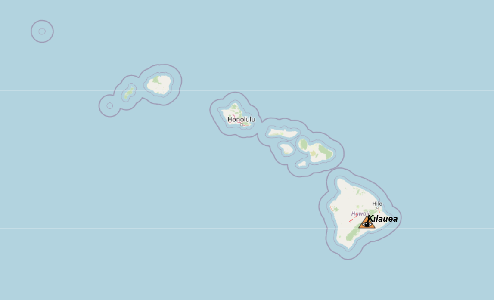
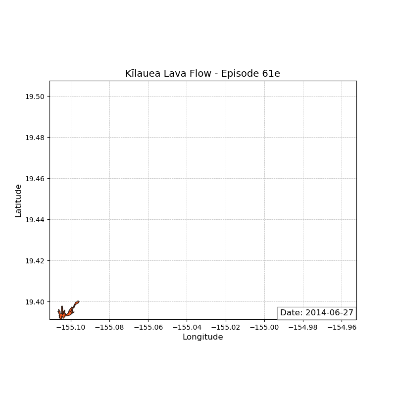
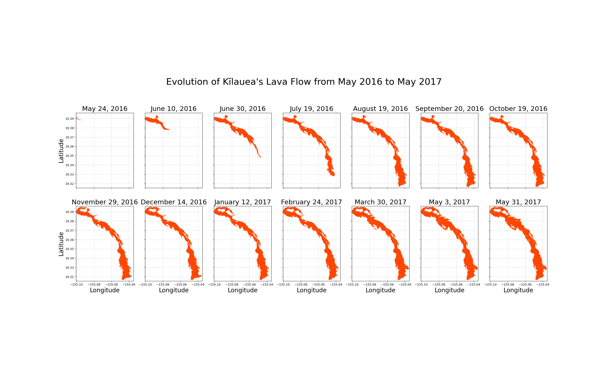
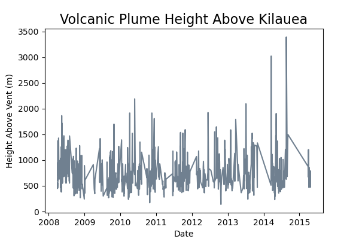
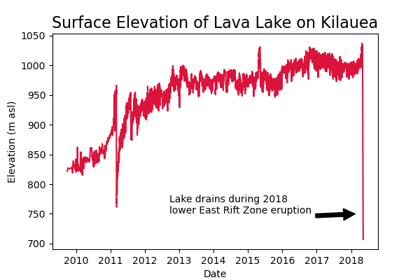
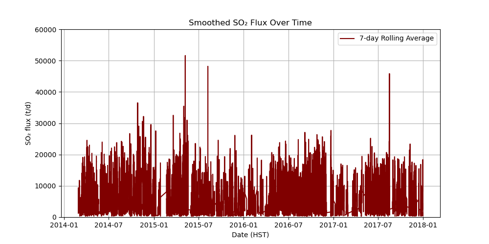

# Kīlauea Volcano Emissions Analysis
Clara Pugh and Lillian Hanson

## Problem Statement/Introduction
We analyzed volcanic emissions and activity monitoring indexes associated with the Kīlauea volcano in Hawaii. This includes lava flow rates and patterns, SO2 emissions, plume height, and lava Kīlauea is currently one of the world's most active volcanos. It is a shield volcano. We wanted to look at how the different forms of volcanic emissions that Kīlauea produces are related to each other. We looked at lava flows, volcanic plume heights, SO2 emissions, and the elevation over time of a lava lake in one of Kīlauea's craters, all using data from the USGS.

This question is significant because understanding these emissions and their implications on volcanic activity can further research into geohazards and could lead to life-saving discoveries.

#### Kīlauea Lava Flow

Kīlauea Lava Flow Image [1]

#### Kīlauea Relative Position

Kīlauea Location Map [2]

## Our Process
We first found our data on the USGS data page for the Kīlauea volcano [3]. The data for the lava flows was in shapefile format, while the rest was in csv format. We used numpy, matplotlib, pandas, and geopandas to assist with our analysis and visualizations.

For our the 2014-2016 lave flow data, due to the large amount of time snapshots available (35), we used an animation to show the growth of the flow over time. From 2016-2017 there were only 8 snapshots, so we showed this progression as a series of graphs.

## Limitations
We focused on data within a range from about 2008-2018, with many of our datasets only covering a few years of time. This means that while the data from each phenomenon that we graphed overlaps in its timeframe with other graphs, not all of our data was taken over the sem timeframes, so we do not have a complete view of how each phenomenon was changing at every time.

## Lava Flows

#### 2014-2016 Lava Flow

With this animation, we see series of fast growth, alternating with time periods with very slow, viscous lava movement. The flow volume, speed, and inferred viscosity can all be correlated with other events like high-plume events and high-SO2 emission periods. 

#### 2016-2017 Lava Flow

We can see that there was a lot of expansion of the lava flow from May to August 2016, and then it started slowing down its growth. This data has similar correlations as the animation above. 

## Volcanic Plume Height

We see in this that the elevation of the volcanic plume above Kilauea was highly variable, although it reached some peaks around the beginning and middle of 2014. Peak height has an overall positive trend leading into our time period of flow collection (2014-2017). 

## Lava Lake Elevation

We can see in this that from 2010 to 2018, the surface elevation of the lava lake on Kilauea (within the within Halemaʻumaʻu crater) was rising fairly steadily, until the volcano began to erupt in the 2018 lower East Rift Zone, which pulled a lot of the magma out from the volcano, and caused the lava lake to drain rapidly. The spike of lake elevation in 2015 lines up with a spike in SO2 emissions. 

## SO2 Emissions

With these 7-day rolling averages we can see a wave-like pattern in SO2 emissions. The spikes may indicate heavier flow periods. When comparing with other data, we can see very steady levels of flow during high-flow times, such as June of 2016. There is a gap around January of 2017, which is interesting because another "leg" of lava flow formed around this time. 

## Final Thoughts

## Sources
[1] [https://www.usgs.gov/volcanoes/kilauea/image-galleries](https://www.usgs.gov/volcanoes/kilauea/image-galleries)

[2] [https://www.usgs.gov/volcanoes/kilauea?vol=WARNING,ADVISORY,WATCH](https://www.usgs.gov/volcanoes/kilauea?vol=WARNING,ADVISORY,WATCH)

[3] [https://www.usgs.gov/volcanoes/kilauea/data](https://www.usgs.gov/volcanoes/kilauea/data)
